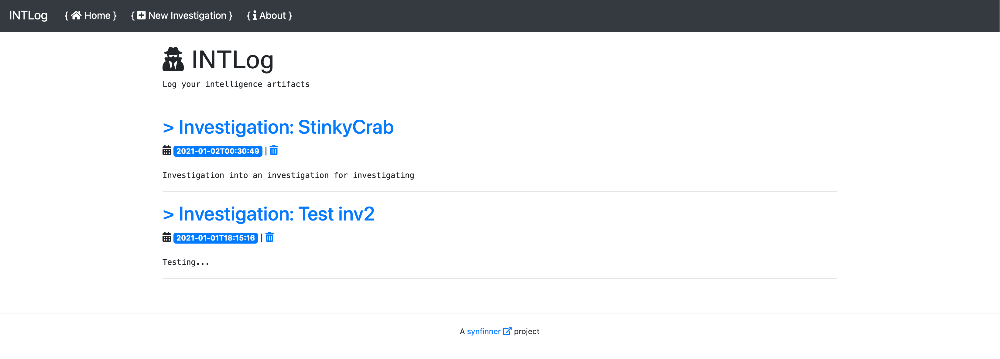
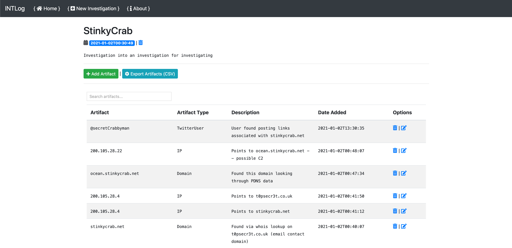

# INTLog

INTLog is a simple Flask app designed to keep track of potentially interesting artifacts during an investigation. 

This application was designed to help me keep track of artifacts that I may stumble across during an investigation. I was originally using things like notepad, maltego, jupyter, and a bunch of other apps. The problem I ran into is that I needed a simple wheel, not a nuclear reactor to log what I was seeing. Secondly, I wanted something that could be hosted locally and data kept on my disk. And just like that, INTLog was born. Simplicity is the name of the game here. This app caters specifically to my needs and maybe it will help you too.

This project is in an EXTREMELY early stage. Stuff is likely terrible.

**TODO:**

- Support pagination
- Likely fix things
- Export to JSON
- Clean up templates
- ~~Move artifact types to sqlite table so we can dynamically generate types when adding a new artifact.~~ 
- Contemplate existence
- Drink coffee

## Setup

Setup env: 

```
INTLog » python3 -m venv env
INTLog » source env/bin/activate
```

Install requirements: `pip3 install -r requirements.txt`

Once the requirements are installed, proceed to setting up the SQLite db.

### Setup SQLite

#### Automated Method

To setup the db, execute the `create_db.py` file. This will create all of the current tables and fields (easiest if you just want to be up and running).

#### Manual Method

Create a new SQLite db within the `data` directory named `intlog.sqlite`

**Setup the investigations table:**

```
CREATE TABLE investigations (
  id integer PRIMARY KEY AUTOINCREMENT NOT NULL,
  investigation_name varchar(128),
  investigation_date timestamp(128),
  investigation_desc text(250)
)
```

**Setup the artifacts table:**

```
CREATE TABLE artifacts (
  id integer PRIMARY KEY AUTOINCREMENT NOT NULL,
  investigation_id integer(128),
  artifact_name char(128),
  artifact_type char(128),
  artifact_desc varchar(250),
  artifact_reference varchar(250),
  artifact_date timestamp(128),
  flagged int(4),
  FOREIGN KEY (investigation_id) REFERENCES investigations (id)
)
```

**Setup the types table:**

```
CREATE TABLE IF NOT EXISTS types (
  id integer PRIMARY KEY AUTOINCREMENT NOT NULL,
  type varchar(128)
);

INSERT INTO types (id, type) VALUES
(1, 'Mailing Address'),
(2, 'Misc'),
(3, 'Username'),
(4, 'URL'),
(5, 'TweetURL'),
(6, 'TwitterUser'),
(7, 'SHA256'),
(8, 'SHA1'),
(9, 'Organization'),
(10, 'MD5'),
(11, 'IP'),
(12, 'HumanName'),
(13, 'Domain'),
(14, 'CIDR');
```

## Exporting Data

INTLog allows you to export all artifacts within an investigtion to a csv file. This allows for importing into other tools or making a backup of artifacts.

## What this project isn't

- This project is not meant to be a replacement for commercial or even open source intel tools. Rather, it is meant purely as an assistive tool for artifact management. As previously stated, the idea is to keep track of interesting artifacts in a simple note per investigation. 
- This tool is not meant to be super advanced and crazy. I began this project with wanting something simple.

## Contributing

If you ever feel so inclined to help out and make things better, please feel free to submit a pull request and I will happily take a look. 

Should you find this helpful in any way, feel free to let me know on twitter: https://twitter.com/synfinner

## Screenshots

Index page: 



Viewing an investigation (note: this is just simulated and random data for testing): 

