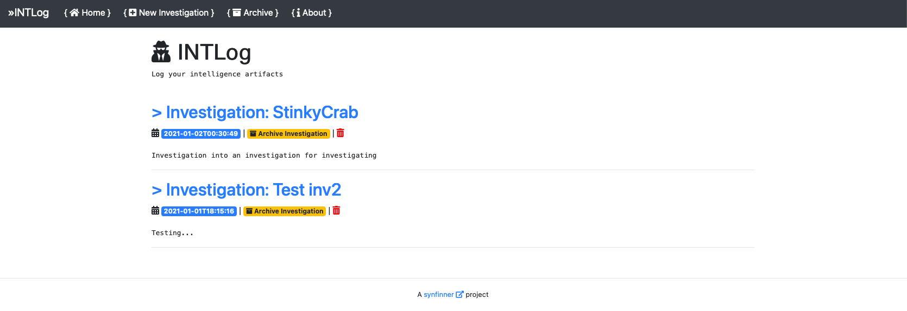
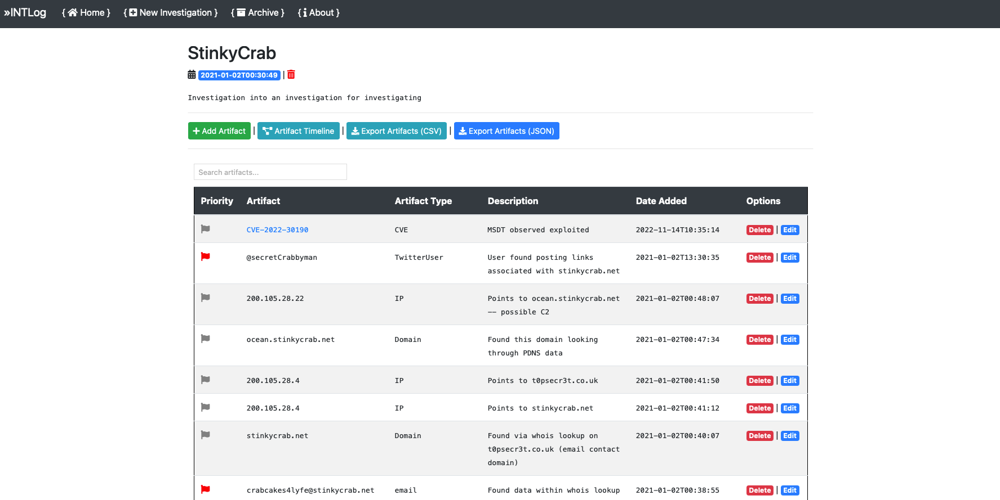
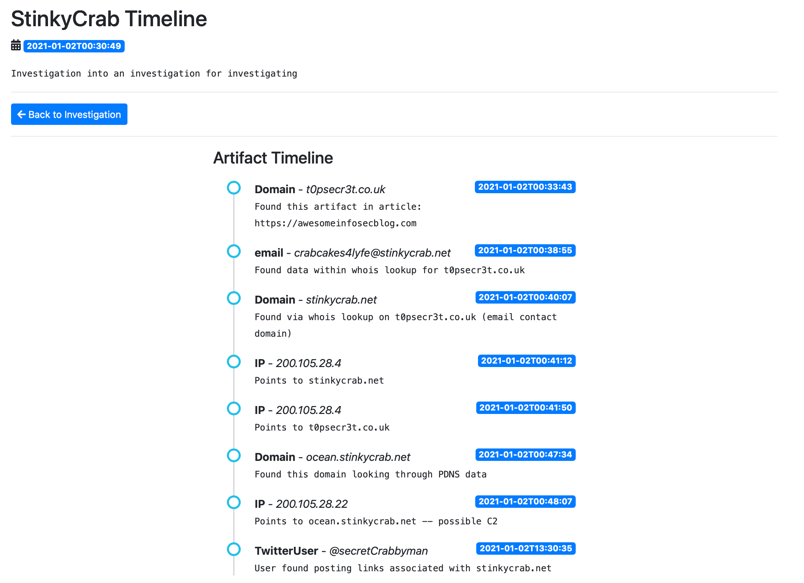
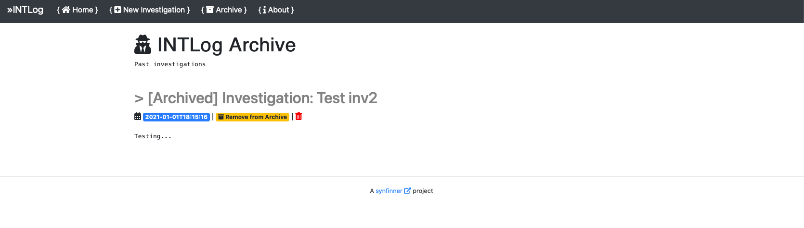

# INTLog

INTLog is a simple Flask app designed to keep track of potentially interesting artifacts during an investigation. 

This application was designed to help me keep track of artifacts that I may stumble across during an investigation. I was originally using things like notepad, maltego, jupyter, and a bunch of other apps. The problem I ran into is that I needed a simple wheel, not a nuclear reactor to log what I was seeing. Secondly, I wanted something that could be hosted locally and data kept on my disk. And just like that, INTLog was born. Simplicity is the name of the game here. This app caters specifically to my needs and maybe it will help you too.

This project is in an EXTREMELY early stage. Stuff is likely terrible.

**TODO:**

- Support pagination
- Likely fix things
- ~~Export to JSON~~
- Clean up templates
- ~~Move artifact types to sqlite table so we can dynamically generate types when adding a new artifact.~~ 
- Contemplate existence
- Drink coffee

## Setup

Setup env: 

```
INTLog » python3 -m venv env
INTLog » source env/bin/activate
```

Install requirements: `pip3 install -r requirements.txt`

### Setup SQLite

This script will automatically create the sqlite file and necessary entries upon first run. 

## Exporting Data

INTLog allows you to export all artifacts within an investigtion to a csv file. This allows for importing into other tools or making a backup of artifacts.

### JSON Output

Each investigation features an "Export Artifacts (JSON)" button for easy JSON Export. Example output: 

```
[
  {
    "artifact": "t0psecr3t.co.uk", 
    "artifact_description": "Found this artifact in article: https://awesomeinfosecblog.com", 
    "artifact_type": "Domain", 
    "date_added": "2021-01-02T00:33:43", 
    "flagged": 1, 
    "id": 12
  }, 
 ...snip... 
  {
    "artifact": "200.105.28.4", 
    "artifact_description": "Points to t0psecr3t.co.uk", 
    "artifact_type": "IP", 
    "date_added": "2021-01-02T00:41:50", 
    "flagged": null, 
    "id": 16
  }
 ]
```

## What this project isn't

- This project is not meant to be a replacement for commercial or even open source intel tools. Rather, it is meant purely as an assistive tool for artifact management. As previously stated, the idea is to keep track of interesting artifacts in a simple note per investigation. 
- This tool is not meant to be super advanced and crazy. I began this project with wanting something simple.

## Contributing

If you ever feel so inclined to help out and make things better, please feel free to submit a pull request and I will happily take a look. 

Should you find this helpful in any way, feel free to let me know on twitter: https://twitter.com/synfinner

## Screenshots

Index page: 



Viewing an investigation (note: this is just simulated and random data for testing): 



Basic Bootstrap timeline of artifacts:



Archive

